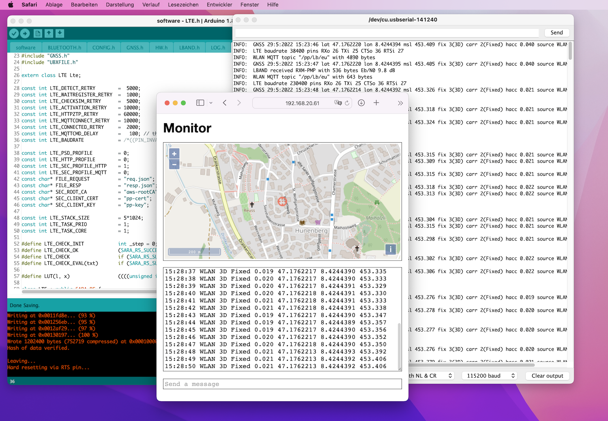
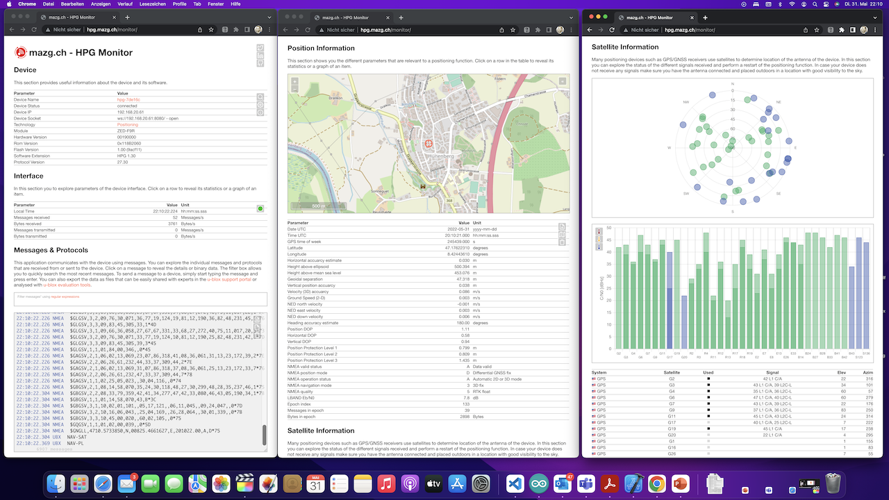
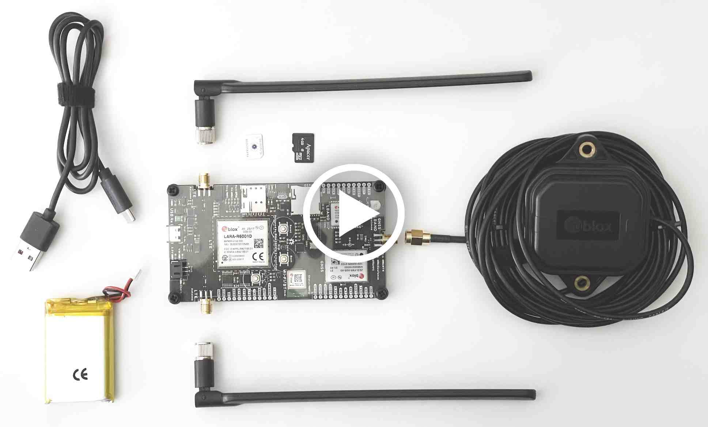
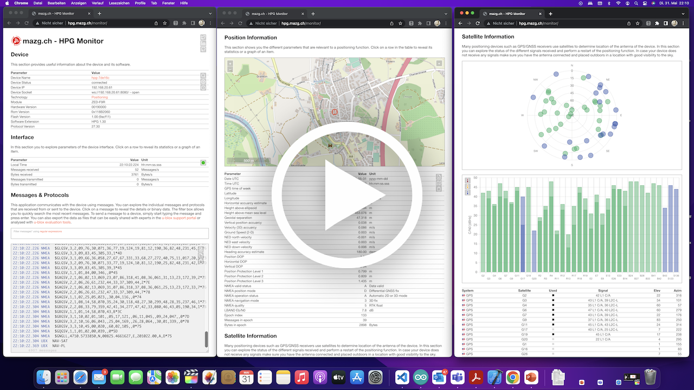
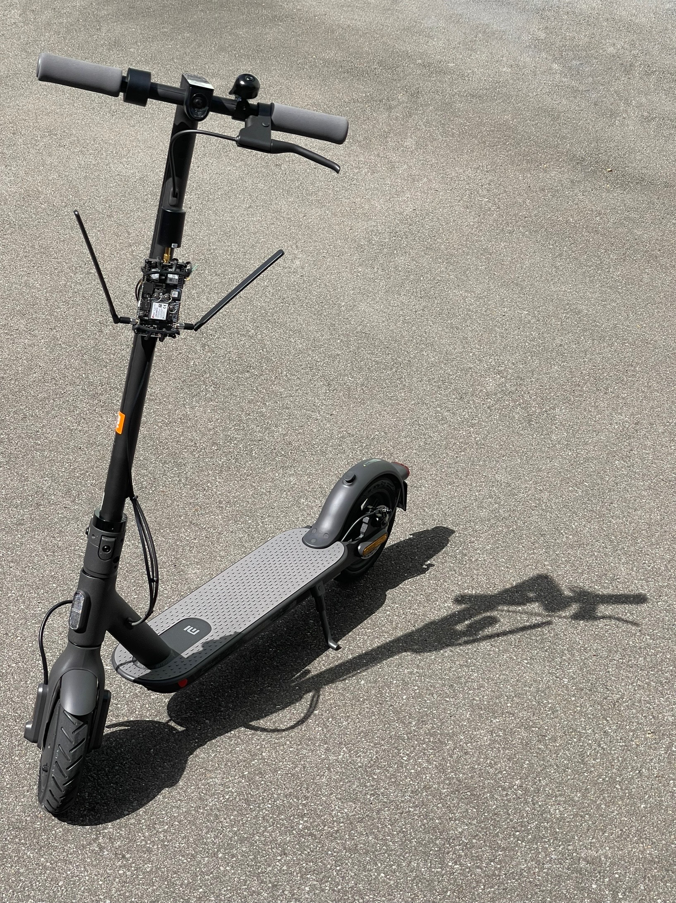
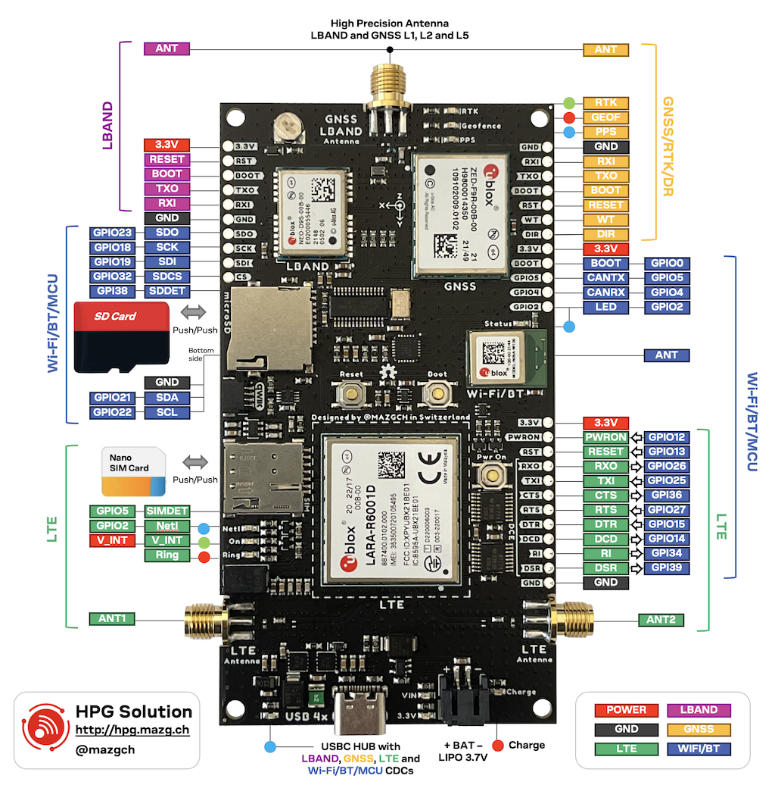
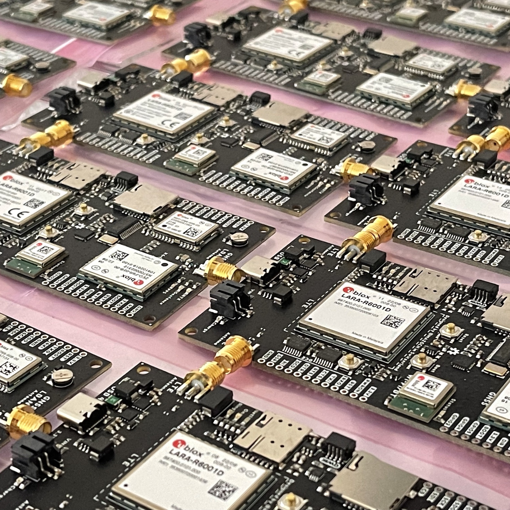
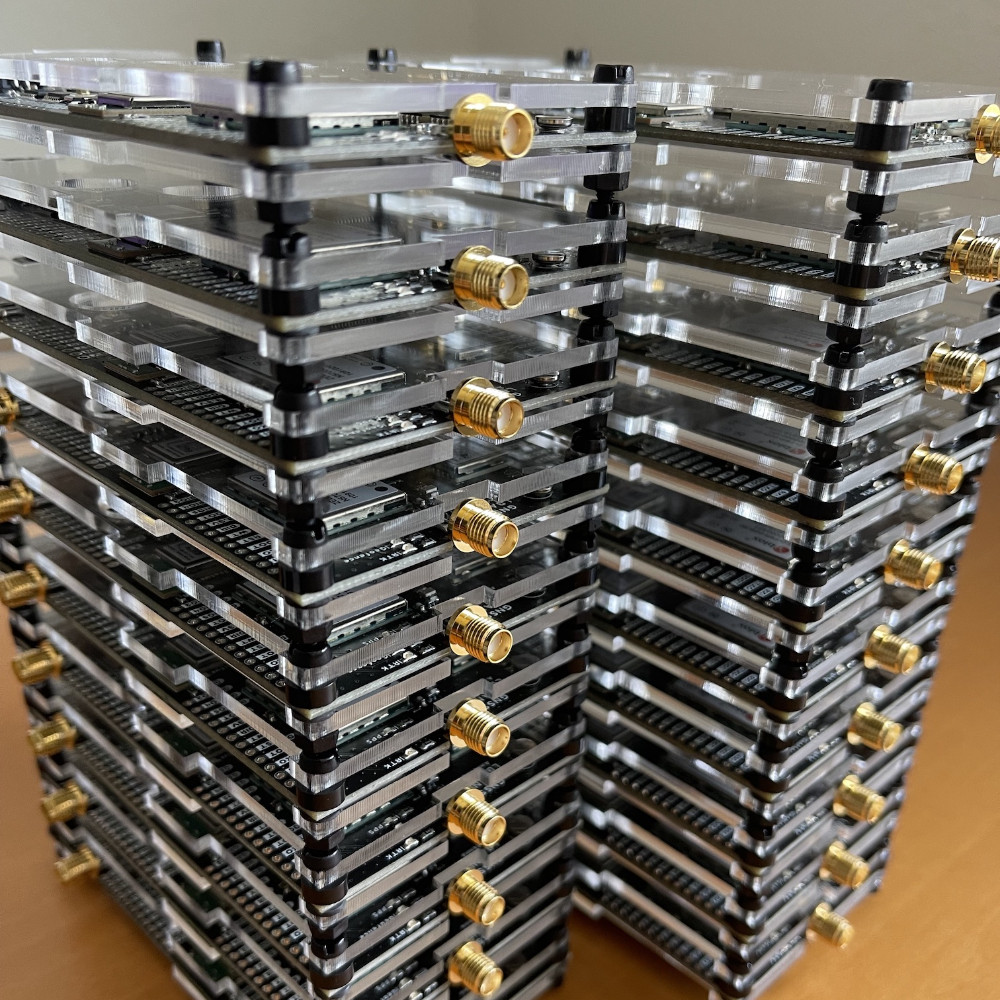

#  mazg.ch - HPG Solution

> **Note** This is a private project from [@mazgch](https://github.com/mazgch)  The code and hardware was developped during my free time. [u-blox](https://www.u-blox.com) decided to launch a simliar, inspired product under the name [XPLR-HPG-2](https://www.u-blox.com/en/product/xplr-hpg-2) along with production grade software based on [ubxlib](https://github.com/u-blox/ubxlib). u-blox has published the [hardware](https://github.com/u-blox/XPLR-HPG-hardware) and [software](https://github.com/u-blox/XPLR-HPG-software) on the [u-blox github account](https://github.com/u-blox). The Arduino software of this project can be compiled for the XPLR-HPG-2/1 by adjusting the HW_TARGET defines in the [`software\HW.h`](./software/HW.h) file and selecting the right module/board. 

This project has the goal to demonstrate a high precision positioning function. It uses a Global Navigation Satellite System (GNSS) L1/L2 receiver with Real Time Kinematic (RTK) and Inertial Measurement Unit (IMU) Sensor based Dead Reckoning (DR) function to determine its location. In order achieve its best accuracy the receiver needs a correction data stream. On this solution the correction data can be received from a satellite broadcast using a LBAND receiver or over IP connectivity using Wi-FI or LTE. While other systems typically use local reference stations as correction source that have to be setup a maintained, this system makes use of a continental wide commercial SSR service. The whole solution shared in this project consist of three parts: 

## The three elements of the HPG Solution 

| [**HPG Hardware**](./hardware) | [**HPG Software**](./software) | [**HPG Monitor Webpage**](./monitor) |
|----------|----------|---------|
|  |  |  |
| The HPG hardware has a GNSS and a LBAND receiver that are used to achieve cm-Level precision. A Wi-Fi/BT module and a LTE modem make sure that the board is always connected to the internet. A USB port is used for changing or connecting a powerful host. The CPU of the Wi-Fi/BT module can be programmed with the HPG Software. | The HPG software implements a captive portal for configuration and monitoring. The software operates autonomously, configures all the modules and handles the different correction data sources and provides its data to the RTK system. It can also record two logfiles to the SD card of the GNSS/LBAND and the LTE communication. | The online HPG Monitor webpage at [hpg.mazg.ch](http://hpg.mazg.ch) is a online tools that allows you visualize the data of the solution. You can plot graph, export data to Excel or other offline tools. Satellite information as well as a map overlay are even available. The different messages and commands can be analyzed in a console. A simpler version can be accessed in the captive portal directly. |  

## Getting started

To make this device work as intended you need some accessories like LTE and GNSS antennas, a mobile data plan and nano SIM card and a subscription to PointPerfect. Follow this sequence to get the device configured and setup, click on the image below for a short YouTube video on how to do some of these steps.

1. Insert a nano SIM card, the socket is a push/push socket so don't try to just pull the card out.
2. Optional: Insert a micro-SD card (FAT, max 32GB) if you like the device to record logfiles. 
3. Attach the two LTE antennas to the SMA ports located on the long edges. To avoid mechanical stress on the center pin, make sure you do not rotate the antenna itself but only the nut of the SMA connector. 
4. Connect a survey grade L1/L2/L5 GNSS and LBAND antenna to the SMA port on the small edge of the device and place the antenna in a location with very good and unobstructed visibility to the sky. This is important to allow reliable LBAND reception as well as avoid multipath errors on the GNSS measurements 
5. Connect a USB cable to a computer, this will turn the device on, and you will see various LEDS turn on. In addition, your computer will enumerate several USB devices and serial as well a modem ports will become available.  

6. Optional: if the [software](./software) is not yet programmed, follow the build instructions of the Arduino based software and load it to the device. 
7. In order to add the device to your local Wi-Fi connect your computer or mobile phone with the `hpg-XXXXXX` Wi-Fi network. You will be directed to a captive portal where you can then enter your networks Wi-Fi credentials. Make sure that the Wi-Fi network that you like to connect to is supporting 2.4GHz band. Once done the device will connect to your local network and get an IP. You may want to reset your device to force a fast reconnection.
8. After the device is connected, you can try to connect to it using its host name `hpg-XXXXXX`. The IP address of the device is also reported in the debug output on the console output CDC port at 115'200 baud. A third option is to use the device discovery of the [HPG Monitor](http://hpg.mazg.ch). Some networks do not allow communication between attached Wi-Fi clients so it may be better to connect the device to your computer or mobile in hotspot mode. 
9. After you have successfully connected your device, you need to configure the PointPerfect location device token that you can get from the Thingstream portal and set the possible correction sources to use. If you do not have a device profile, create one with following settings: ``Status = enabled, Auto Activate Devices = true, Hardware Code = mandatory`` Return existing device details if Hardware Code is in use. You can also set the SIM pin, but it is often easier to remove the SIM pin from your SIM card with a mobile phone first. Alternatively you can provide the ``u-centerConfig.json`` to the device.  
10. After that the device will provision the credentials using zero touch provisioning (ZTP) from the PointPerfect servers.
11. Now you are ready to Monitor the operation of the device using the console output on the CDC, using the Monitor webpage that is served directly by the device.

  
11. You can also access and find your hpg devices using the HPG Monitor webpage at [hpg.mazg.ch](http://hpa.mazg.ch) This webpage displays various status information, messages and can even plot graphs of parameter or satellite signal strenghs. A map overlay completes the functionality of the HPG Monitor. You can even export your data a text, in common file formats for offline tools.
12. You are now ready to start experimenting with this exciting technology and go outside and test RTK positioning in your use cases. The solution is suitable for a variety of applications from Lawn Mower, Heavy machine and Construction vehicles, Drones, Precision Agriculture, Cars and of course Mobile Robotics. 
13. To get best performance sure that the GNSS/LBAND antenna is well positioned and has good visibility to the sky!
14. So have fun and put this solution on your robot, [vehicle](docu/Vehicle.md), [scooter](docu/Scooter.md) or [lawn mower](docu/Mower.md) project. Feel free to connect with me even if it’s just to share the projects you are building using this exciting technology and solution.

  

## Quick Reference Card

## An all [u-blox](https://www.u-blox.com) solution

This solution is an attempt to design a 'full u-blox solution' using various products In particular the solution implements following hardware and services:

| u-blox Product / Service | Description |
|:--------------:|-----------------------|
| [NINA-W106](https://www.u-blox.com/en/product/nina-w10-series-open-cpu) | An ESP32 based WIFI and BT module with Open CPU that will host the application.     | 
| [LARA-R6001D](https://www.u-blox.com/en/product/lara-r6-series) | A LTE Cat 1 cellular modem with 2G / 3G fallback. |
| [ZED-F9R](https://www.u-blox.com/en/product/zed-f9r-module) | A GNSS Module with RTK, DR and L1/L2 multiband capability. |
| [NEO-D9S](https://www.u-blox.com/en/product/neo-d9s-series) | A LBAND receiver to get PointPerfect correction service. | 
| [ANN-MB](https://www.u-blox.com/en/product/ann-mb-series) | L1/L2 multi-band, high precision GNSS antenna (LBAND is not offically supported, it may work but there is a slight degradation depending on the frequency) | 
| [PointPerfect](https://www.u-blox.com/en/product/pointperfect) | A continental wide SSR correction service with coverage in Europe and North America. |
| [AssistNow](https://www.u-blox.com/en/product/assistnow) | A assisted GNSS services that allows to speed up the system start. |

The hardware allows different SKUs and can be assembled with alternative modules with compatible form-factors such as [SARA-R510S](https://www.u-blox.com/en/product/sara-r5-series), [LENA-R8001](https://www.u-blox.com/en/product/lena-r8-series), [ZED-F9P](https://www.u-blox.com/en/product/zed-f9p-module) or [NEO-D9C](https://www.u-blox.com/en/product/neo-d9c-series).

## Availability

As this is a private project, availability of real prototypes and hardware is pretty much limited to friends and colleagues. I am sharing here my work with the open source community with the goal that others can learn from it and collaborate. If you like to have a discussion or business interesst you can contact me with a DM.

 

