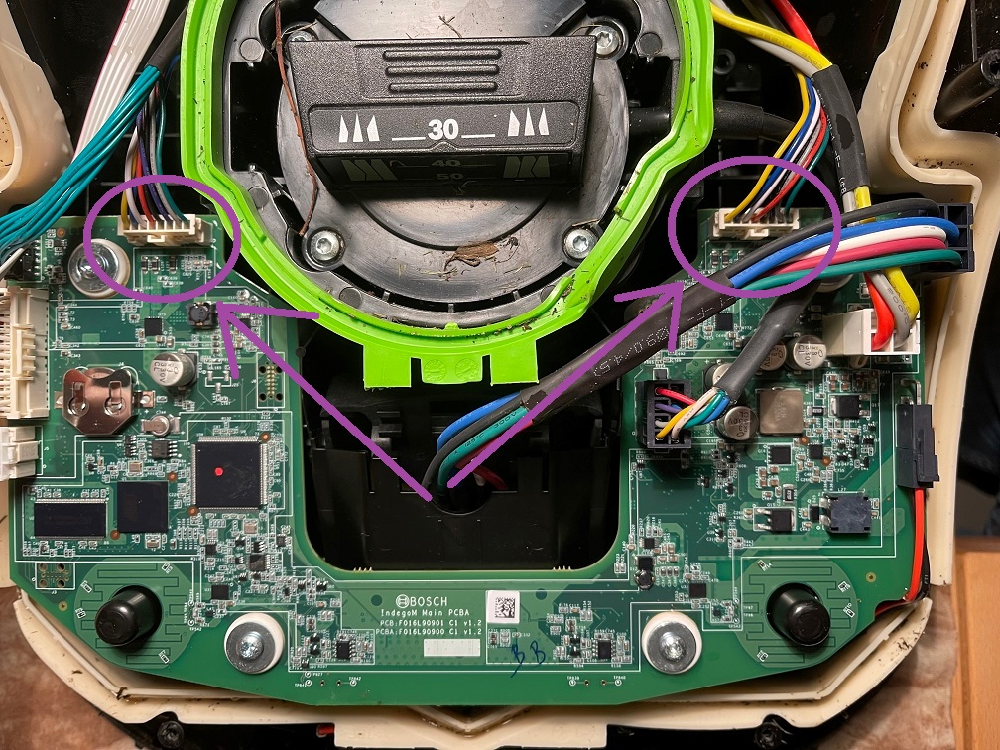

# Lawn Mower

The HPG solution can be easily fitted to a lawn mower to test the performance. 

The scooters from BOSCH can be easily hacked to extract the Hall sensor signals that are used as a distance sensor by the ZED-F9R WT input. 

