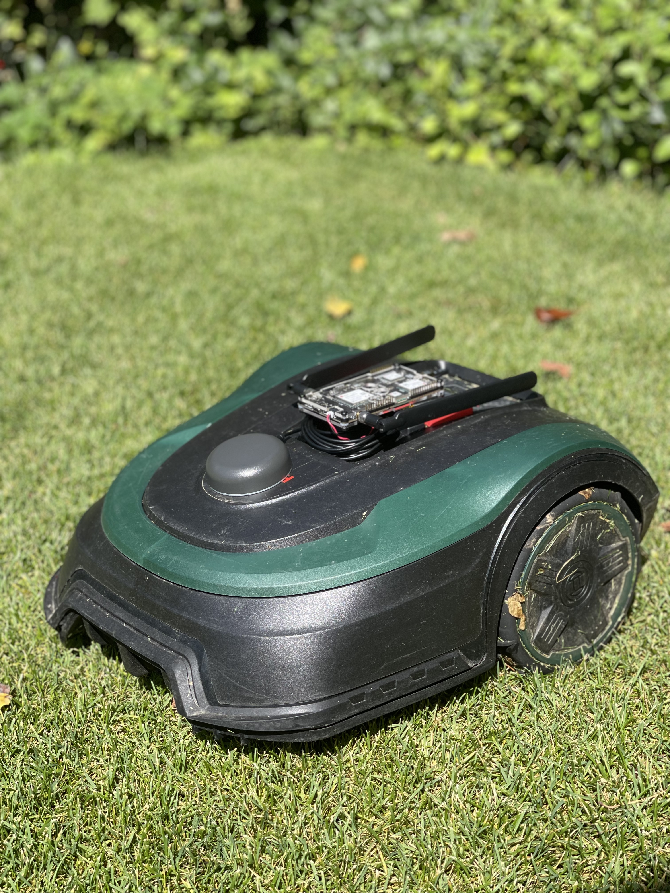
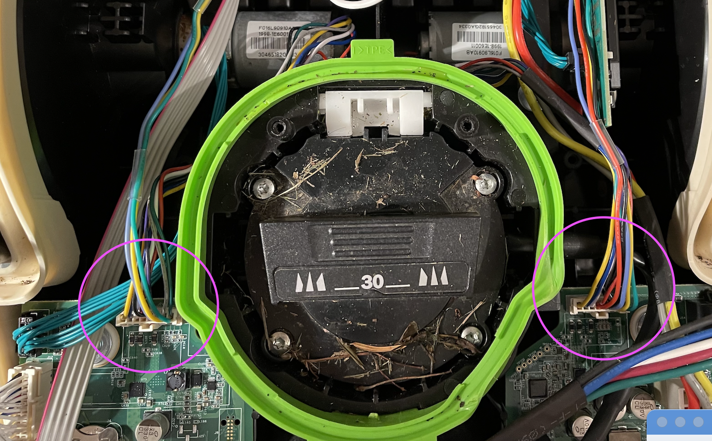
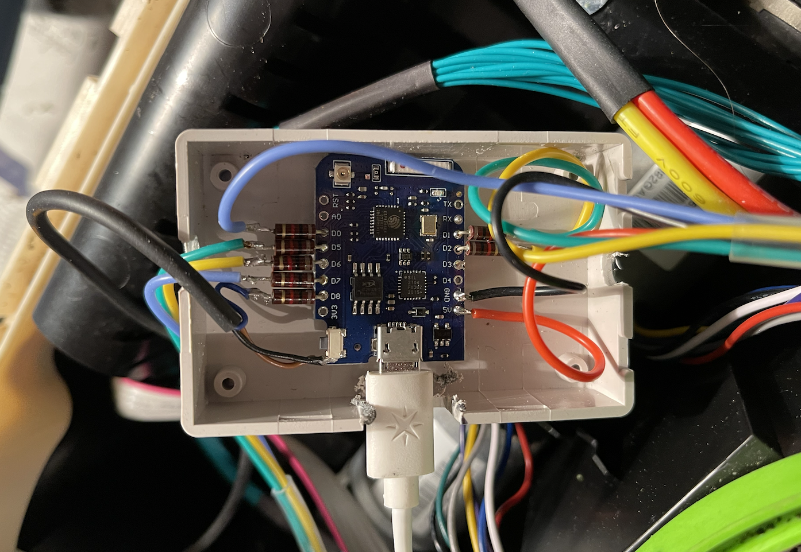
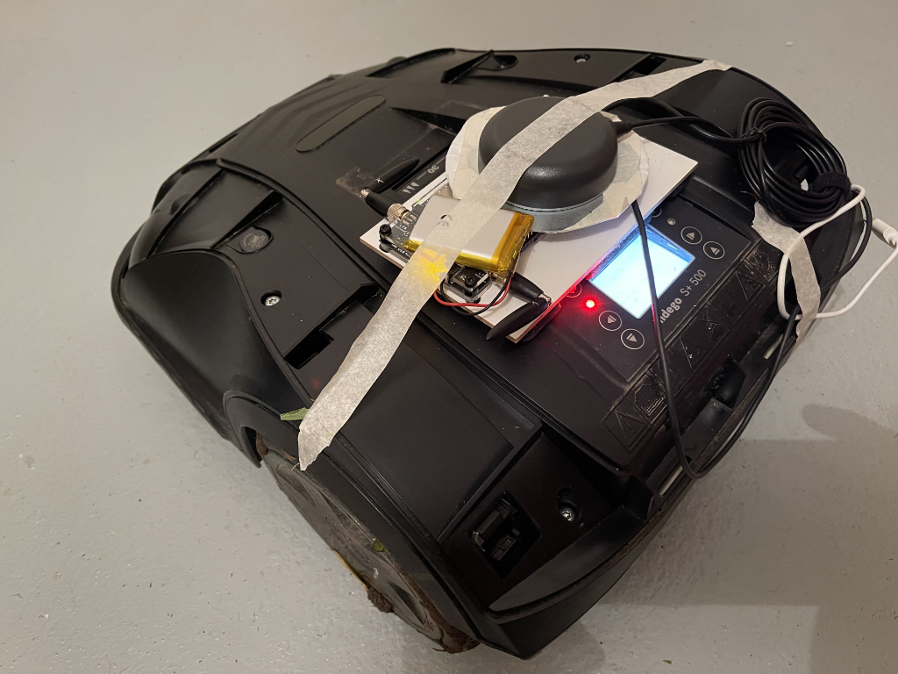
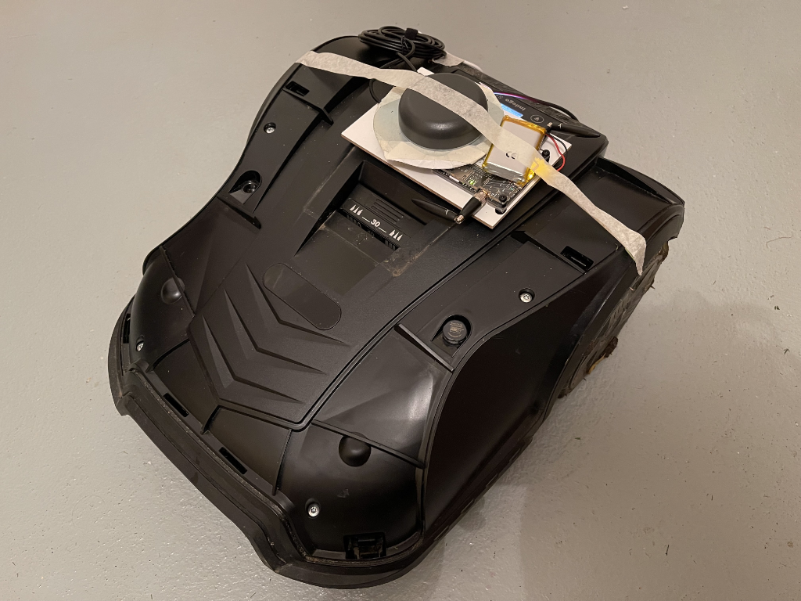
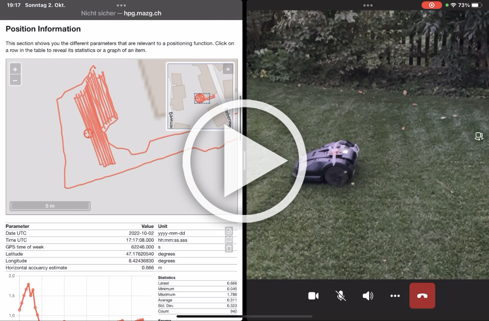

# Lawn Mower & Slow Moving Robots

The HPG solution can be easily fitted to a lawn mower or slow moving robot to test the performance. 

The scooters from BOSCH can be easily hacked to extract the Hall sensor signals that are used as a distance sensor by the ZED-F9R WT input. First you need to open the mower. Remove the green and black cover by releasing the 6 plastic latched from the bottom side. Release the 8 screws, 6 are easily accessible and two are hidden under the black botton with an arrow next to the red stop botton. Now the black cover can be removed. The Hall sensors signals can be tapped in on the Green, Purple and Gray wires on the two motor connectors. In addition Red is 5V and may be Black is GND and5 volts. The signal from the ahll sensor is 3.3Vand can directly be used. The three thicker wires are to drive the motor. 

To convert the Hall sensors signals to a ``UBX-ESF-MEAS`` a small Arduino MCU with at least 7 GPIOs is used. This code could be integrated with the main project but we don't have enough spare GPIOs on the hpg board and maybe it also better to avoid lareg delays in processing and sampling the signals. For details about standalone software project [wtBox](../software/wtBox/). I used 1kOhm resistors to connect the wtBox to the Hall sensor wires, and also for the connection to the HPG board ``ZED RXI`` pin and ``GND`` pins. The following picture shows how the board is connected to the wires, at the time of this photo the non defualt ``D8`` was used for ``D4 TX1 -> ESF-MEAS -> ZED RXI``, this was later changed to the default ``D4 TX1`` location.

Here is the HPG board and antenna mounted to the Mower the GNSS antenna and the IMU sensnor is positioned with X axis pointing accurately towards the front and centered above the rear axle. This will ensure best performance and only minimal configuration for sensor fusion is needed.  

  

Here is a short video of the mower and the monitor in action.The first 10 minutes shows the calibration of the sensors and the wheel ticks, during this time Sensor fusion is initializing and calibrating. At position [9:50](https://youtu.be/d0S1z9fmatQ?t=590) the Sensor Fusion swiches into fusion mode and is now able to naviagte more reliably using the sensors and determine the heading even while rotatig at its location. 

