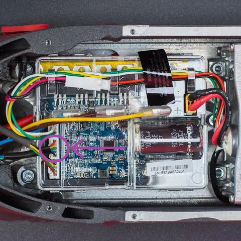

# Scooter

The HPG solution can be easily fitted to a scooter to test the performance. 

The scooters from XIAOMI can be easily hacked to extract the Hall sensor signal that is needed a distance sensors by the ZED-F9R WT input. 
The hall sensors a rlocated in the front wheel next to the motor. The singal are connected to the Motro controller that is in the base of 
the Scooter. To open the base plate remove the torx Screws from the bottom side. This will reveal the controlle. The Hall sensor connector 
is the white 5 pin 2mm JST connector. The connector carries three hall sensors signals (yellow, green and blue), 5V (red) and GND (black).
The hall sensors output a signal between 0 and 3.3V when the scooter is on and the wheel is rotated. Select one of the HAll sesnors and 
connect it to the ZED-F9R WT input with a series resistor (e.g 1k). The GND can be directly connected to the GND of the HPG solutions. In 
my case I routed the cable through the steering bar up to the handle bar. You need to bypass some foam and squeeze it though the rubber parts 
along the other cables, but this gives a clean nice setup.

At the handle bar you need to mount the HPG solution board leveled, with x-Acix pointing in drive direction. This is important in order 
to use the default sensor alignment settings, otherwise you need to manually set the alignment of the HPG board with UBX configuration 
commands in the ZED-F9R. Select also the scooter dynamic model and save itMake sure that you fix the board tightly so that it does not 
fall off or gets tilted on handle bar. The antenna is very critical to achive best performance, use a path with GND plane or a helix 
antenna. Avoid the other antennas being in close and point them away to avoid obstruction. 

