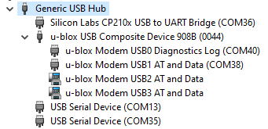

# Software


The software ensures full autonomous operation of a high precision solution using cellular or Wi-Fi network for internet connectivity. u-center compatible logging of GNSS data can be stored on SD card. In parallel full evaluation capability should be feasible by giving direct access to the modules through USB to all modules, this interface is also used to update software and firmware of the modules. The application that will runs on the NINA-W106 is be open sourced and serve as an example that can be tailored to different use cases. Ideally the board can be shipped with a software that can be configured using captive portal 

## Features
- Captive and Web portal for configuration of the system and setting Wi-Fi credentials
- Reporting of status on the console using CDC on USB 
- Storing of GNSS UBX and AT commands file to SD card
- Provisioning of PointPerfect credentials using zero touch provisioning (ZTP) by providing device profile token
- Reception of Pointperfect corerection data using the MQTT protocol over WIFI an LTE
- Management of different regional correction stream to only ensure one active connection per device. 
- configuration of LBAND frequency and communication settings depending on location and PointPerfect subscription plan. 
- Configuration of the GNSS correction source depending on incoming LBAND or IP data
- Hot plug and runtime detection of gnss, lband and SD card

## Captive portal
A captive portal is available for configurating the device. Select the Wi-Fi network `hpg-XXXXXX` with a notebook or mobile phone. You can then enter the Wi-Fi network to connect to, configure the Point Perfect device token, stream preferences as well as the LTE related settings. 
The captive protal also will show the client ID when provisioned. 


## Host drivers & tools
The USB port exposes each module as serial ports, the LARA is also recognized as a modem. These ports are available for a prowerful host or to connect the various u-blox evaluation tools or a terminal program: 

- [m-Center Cellular Evaluation Tool](https://www.u-blox.com/en/product/m-center)
- [u-center GNSS Evaluation Tool](https://www.u-blox.com/en/product/u-center)

The solution might require installation of drivers these are either available from Microsoft Update or from the u-blox and third party websites.



- [LARA-R6 Drivers](https://content.u-blox.com/sites/default/files/2022-04/ublox_LARA-R6xx_%20windows_3264_v1.0.0.0.exe.zip?_ga=2.252269961.1659128418.1651476145-545066222.1627045718)
- [SiLabs CP2101N Drivers](https://www.silabs.com/developers/usb-to-uart-bridge-vcp-drivers)
- ZED-F9 and NEO-D9 works with the standard Windows drivers. [This application note explain details](https://www.u-blox.com/sites/default/files/WindowsDrivers_AppNote_%28UBX-19005821%29.pdf)
- USB Hub works with the standard Windows drivers.

## CDC interface: 
The solution provides a debug console on a CDC USB port. This interface can be used to update this application firmware after compiling it in the Arduino environment. After normal startup it will provide visibility of the activity of the solution. Messages are tagged depending on their severity and software block. 

```
INFO:  -------------------------------------------------------------------
INFO:  u-blox HPG solution
INFO:  MAIN task on core 1
INFO:  CONFIG::init FFS ok
INFO:  CONFIG::init "FFS/config.ffs" read
INFO:  UBXSD task on core 1
INFO:  UBXSD card state changed 1 (removed)
INFO:  LBAND detect receiver detected
INFO:  LBAND detect configuration complete, receiver online
INFO:  GNSS detect receiver detected
INFO:  GNSS detect injecting saved key 60 bytes
INFO:  GNSS detect configuration complete, receiver online
INFO:  LED task on core 1
INFO:  WLAN task on core 0
INFO:  LTE task on core 1
INFO:  WLAN init autoconnect using wifi/hostname "u-blox-hpg-7d6de378"
INFO:  LBAND received RXM-PMP EB/N0 37 with 528 bytes
INFO:  GNSS spartanUseSource 1-PMP from source LBAND
INFO:  LBAND received RXM-PMP EB/N0 37 with 528 bytes
INFO:  GNSS 30:4:2022 19:21:08 lat 47.1762495 lon 8.4243838 msl 453.130 fix 3(3D) carr 2(Fixed) hacc 0.025 heap 121188
INFO:  WIFI state change 1(searching)
INFO:  WLAN poll got connection
INFO:  WLAN poll connected with hostname "u-blox-hpg-7d6de378" at IP 192.168.20.57 RSSI -51 dBm
INFO:  WLAN poll visit portal at "http://192.168.20.57/"
INFO:  WLAN bindCallback webserver started
INFO:  WIFI state change 3(provisioned)
INFO:  GNSS 30:4:2022 19:21:09 lat 47.1762495 lon 8.4243838 msl 453.139 fix 3(3D) carr 2(Fixed) hacc 0.026 heap 61696
INFO:  LTE config manufacturer "u-blox" model="LARA-R6401D" version="00.11"
INFO:  LTE state change 1(check sim)
INFO:  LTE SIM card status "READY" CCID="89410112191214532555"
INFO:  LBAND received RXM-PMP EB/N0 35 with 528 bytes
INFO:  LTE IMEI="359352450003076" IMSI="228012122453255" subscriber=""+41799613242"
INFO:  LTE state change 2(sim ready)
INFO:  LTE state change 3(wait register)
INFO:  GNSS 30:4:2022 19:21:10 lat 47.1762496 lon 8.4243839 msl 453.133 fix 3(3D) carr 2(Fixed) hacc 0.027 heap 59320
INFO:  GNSS 30:4:2022 19:21:11 lat 47.1762496 lon 8.4243839 msl 453.135 fix 3(3D) carr 2(Fixed) hacc 0.027 heap 52384
INFO:  LBAND received RXM-PMP EB/N0 39 with 528 bytes
INFO:  GNSS 30:4:2022 19:21:12 lat 47.1762495 lon 8.4243837 msl 453.141 fix 3(3D) carr 2(Fixed) hacc 0.022 heap 67196
INFO:  WLAN MQTT connect to "pp.services.u-blox.com":8883 as client "c07eae12-a01d-4f23-8b8f-dd67a753f3b7"
INFO:  WIFI state change 4(connected)
INFO:  WLAN MQTT subscribe "/pp/ubx/mga"
INFO:  WLAN MQTT subscribe "/pp/ubx/0236/Lb"
INFO:  LBAND received RXM-PMP EB/N0 39 with 528 bytes
INFO:  WLAN MQTT "/pp/ubx/mga" received 8184 wrote 8184 of total 8184 bytes
INFO:  WLAN MQTT "/pp/ubx/0236/Lb" received 60 wrote 60 of total 60 bytes
INFO:  WLAN MQTT subscribe "/pp/Lb/eu"
INFO:  GNSS 30:4:2022 19:21:13 lat 47.1762496 lon 8.4243838 msl 453.130 fix 3(3D) carr 2(Fixed) hacc 0.022 heap 69976
INFO:  GNSS spartanUseSource 0-SPARTAN from source WLAN
INFO:  WLAN MQTT "/pp/Lb/eu" received 232 wrote 232 of total 232 bytes
INFO:  GNSS 30:4:2022 19:21:14 lat 47.1762496 lon 8.4243838 msl 453.129 fix 3(3D) carr 2(Fixed) hacc 0.022 heap 71756
INFO:  WLAN MQTT "/pp/Lb/eu" received 4690 wrote 4690 of total 4690 bytes
INFO:  WLAN MQTT "/pp/Lb/eu" received 572 wrote 572 of total 572 bytes
INFO:  LBAND received RXM-PMP EB/N0 38 with 528 bytes
INFO:  GNSS 30:4:2022 19:21:15 lat 47.1762496 lon 8.4243838 msl 453.131 fix 3(3D) carr 2(Fixed) hacc 0.023 heap 71756
INFO:  GNSS 30:4:2022 19:21:16 lat 47.1762494 lon 8.4243831 msl 453.149 fix 3(3D) carr 2(Fixed) hacc 0.021 heap 71756
INFO:  LBAND received RXM-PMP EB/N0 40 with 528 bytes
INFO:  GNSS 30:4:2022 19:21:17 lat 47.1762495 lon 8.4243833 msl 453.139 fix 3(3D) carr 2(Fixed) hacc 0.021 heap 71756
INFO:  LBAND received RXM-PMP EB/N0 39 with 528 bytes
INFO:  GNSS 30:4:2022 19:21:18 lat 47.1762495 lon 8.4243833 msl 453.145 fix 3(3D) carr 2(Fixed) hacc 0.021 heap 71756
INFO:  WLAN MQTT "/pp/Lb/eu" received 136 wrote 136 of total 136 bytes
INFO:  GNSS 30:4:2022 19:21:19 lat 47.1762495 lon 8.4243833 msl 453.152 fix 3(3D) carr 2(Fixed) hacc 0.022 heap 71756
```

## Known Issues
- Rarely the software crashes and the webserver maybe not so responsive (about 10s) as it is not asynchronous. It seems this is caused by low memoryand was improved by optimizing usage and now is more stable. **imroved**
- When connecting the board to a windows hotspot, then it seems that the network stack of the laptop gets confused. It is unclear why this happens maybe the dhcp or other service of the captive portal causes these issues. Better use a hotspot or ihone mobile hotspot mode.
- Since the latest arduino_esp32 SDK it seems that parallel wifi and SD is causing issues. start_ssl_client fails during MQTT connect, maybe some dependency on the use of the file system of available heap. **solved**
- 2.0.4 had a issue with partition maps when 2MB is selected, workarount is to use 4MB or stay with 2.0.3 **solved**

## Build instructions
This software uses the free **Arduino IDE** that you can download from [their website](https://www.arduino.cc/en/software). It is recommended to use the installer (not the windows store App) as there have been on some PCs issues with running the compiler. The board uses a ESP32 based module, the NINA-W106 or Sparkfuns ESP32 Micromod. In order to compile the software for this target you need to install the [**arduino-esp32**](https://github.com/espressif/arduino-esp32) board support package. The [install instructions](https://docs.espressif.com/projects/arduino-esp32/en/latest/installing.html) will guide you through that process. At the time of writing these instructions, it is recommended to use the current development release of the package as some critical fixes that this software relies on were just recently contributed to this package. Then go to the board manager and install the esp32 package. When done you may need to restart to select and configure the Arduino IDE to use the correct device, please select **u-blox NINA-W10 series** and make sure the various settings are like in following screenshot: 


The software makes use of several proprietary libraries and packages, all the packages can be downloaded using the library manager (recommended) or manually downloaded installed using GitHub, for this project some fixes and features were contributed to the following libraries so please makes sure you have the latest beta or even development version. You will find library manager links also in the software.ino file just click them all and install the needed package, some links give you multiple option please select carefully the right package: 
- [arduino-esp32](https://github.com/espressif/arduino-esp32) used for NINA-W1 target and SD, FS, Wifi, SPI and many other functions provided by the ESP chip
- [ArduinoMqttClient](https://github.com/arduino-libraries/ArduinoMqttClient) for communicating with PointPerfect MQTT broker 
- [ArduinoJson](https://github.com/bblanchon/ArduinoJson) Json for storing configurations and parsing ZTP messages  
- [WiFiManager](https://github.com/tzapu/WiFiManager) Captive and configuration portal
- [ArduinoWebsockets](https://github.com/gilmaimon/ArduinoWebsockets) in future we may communicate with a website using web sockets
- [SparkFun_u-blox_GNSS_Arduino_Library](https://github.com/sparkfun/SparkFun_u-blox_GNSS_Arduino_Library) can be used for ZED-F9 or NEO-D9 communication using UBX or NMEA
- [SparkFun_u-blox_SARA-R5_Arduino_Library](https://github.com/sparkfun/SparkFun_u-blox_SARA-R5_Arduino_Library) can be used to communicate using AT commands with SARA or LARA LTE modems
